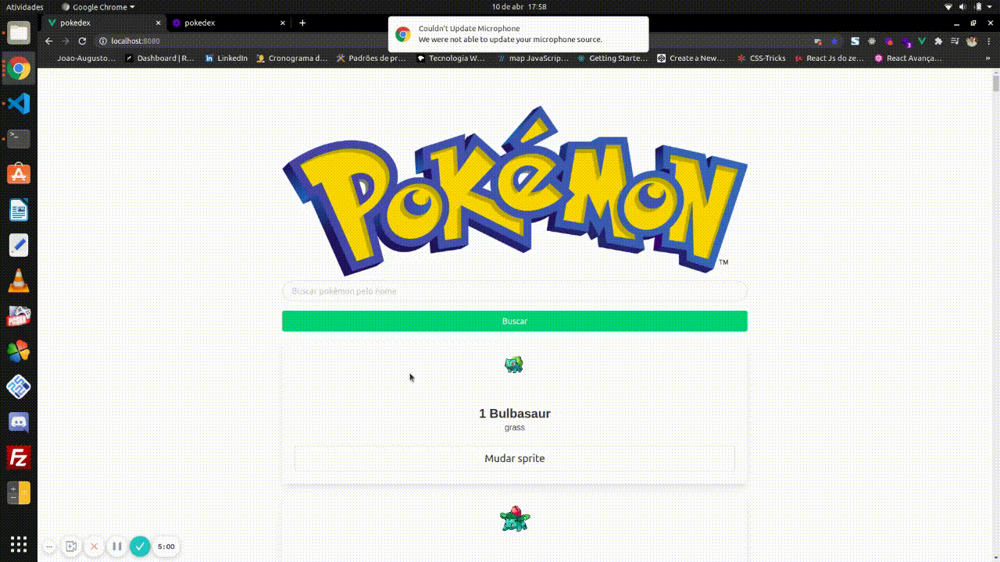

<div align="center">

<h3>

Projeto desenvolvido durante o Curso Vue JS (guia do programador), utilizando **HTML**, **JAVASCRIPT**, **VUE.JS** e **BULMA**.

</h3>

<br>

  

</div>

<br>

## 📚 **Sobre**

O Pokedex é um App de listagem e busca de Pokémons da primeira geração do anime.

<br>

### 📌  **Tecnologias utilizadas**
* HTML
* Bulma
* JavaScript
* Vue.js
* Axios

<br>

### 🚀 **Mão na massa**

```bash
# Clone este repositório
git clone https://github.com/Joao-Augusto-Oliveira/pokedex

# Acesse a pasta do projeto no terminal/cmd
cd pokedex

# Instale as dependências
npm install

# Rode o aplicação
npm run serve

```

<br>
<br>

<h3 align="center">
Feito com 💜 por <a href="https://www.linkedin.com/in/joão-augusto-oliveira-dos-santos-9b0693195">João Augusto
</h3>

<!-- Links -->
